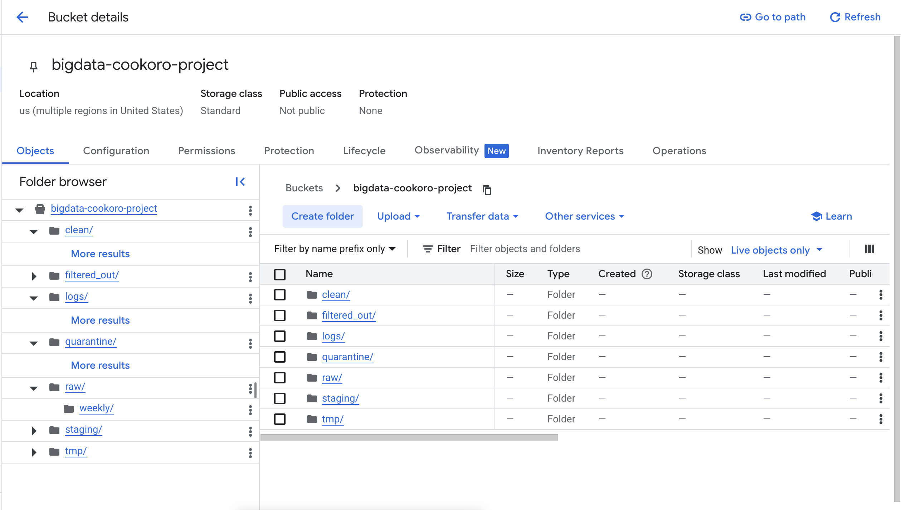
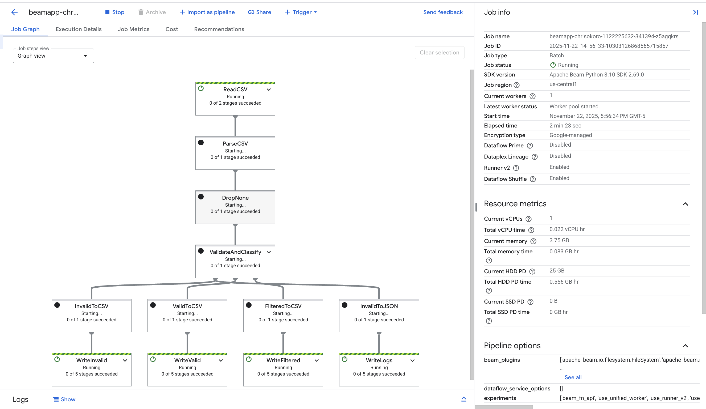
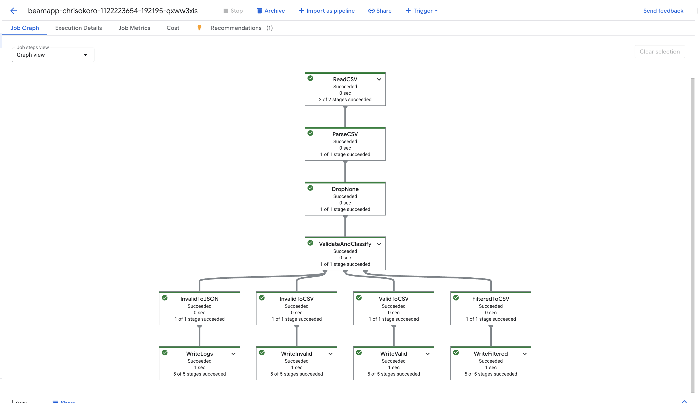
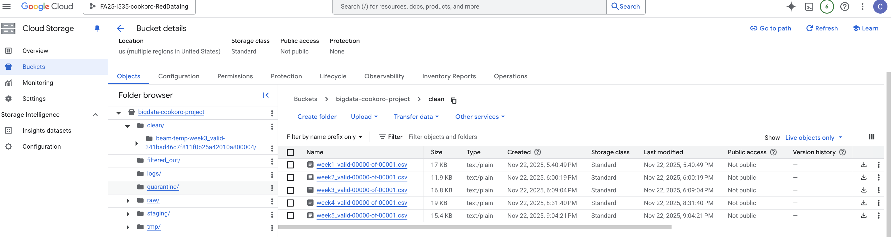
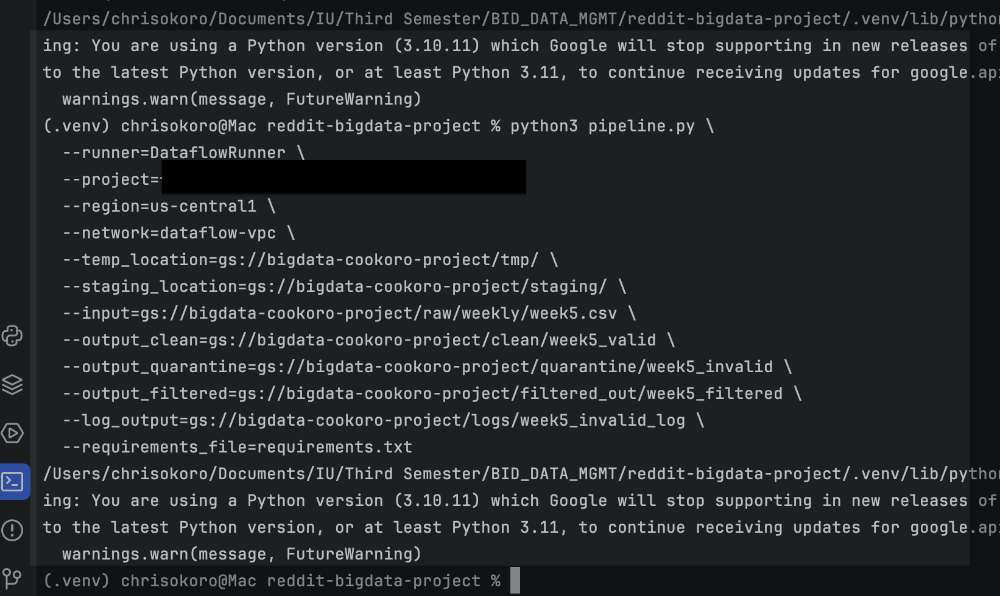

# Distributed Data Processing Pipeline

A cloud-based distributed ETL pipeline built with **Apache Beam** and **Google Cloud Dataflow** to process weekly Reddit CSV data stored in **Google Cloud Storage (GCS)**.

This project demonstrates how batch data can be ingested, validated, classified, and routed through a scalable cloud pipeline. The workflow reads raw weekly Reddit CSV files, parses records, applies validation and filtering rules, and writes outputs into separate storage layers for clean, filtered, quarantined, and logged records.

---

## Project Overview

The goal of this project was to build a repeatable distributed data processing workflow for Reddit post data using GCP services. Instead of processing files locally, the pipeline was deployed to **Google Cloud Dataflow**, where Apache Beam transformations handled record parsing, validation, classification, and output routing at scale.

The pipeline was designed to separate data into meaningful categories:

- **Clean records** that passed validation
- **Filtered records** that met exclusion rules
- **Quarantined records** that failed validation
- **Logs** capturing invalid records for traceability

This setup reflects a more organized, production-style ETL workflow in the cloud.

---

## Key Features

- Processes weekly Reddit CSV files in a distributed cloud environment
- Uses Apache Beam transformations for parsing, validation, and routing
- Runs on Google Cloud Dataflow for scalable batch execution
- Stores outputs in dedicated GCS folders:
  - `clean/`
  - `filtered_out/`
  - `quarantine/`
  - `logs/`
- Supports repeatable weekly ingestion and processing
- Includes raw input files, project screenshots, and final report for documentation

---

## Tech Stack

- **Python**
- **Apache Beam**
- **Google Cloud Dataflow**
- **Google Cloud Storage**
- **GCP IAM / Service Permissions**

---

## Repository Structure

```text
distributed-data-processing-pipeline/
│
├── pipeline.py
├── requirements.txt
├── README.md
│
├── data/
│   └── raw/
│       ├── week1.csv
│       ├── week2.csv
│       ├── week3.csv
│       ├── week4.csv
│       └── week5.csv
│
├── report/
│   └── cookoro-finalproject.pdf
│
└── screenshots/
    ├── raw-data-csv.png
    ├── gcs-bucket.png
    ├── assigning-cloud-permissions.png
    ├── dataflow-dag-processing.png
    ├── dataflow-dag-success.png
    ├── gcs-clean-directory.png
    └── apache-beam-job.png
```

## Dataset

The pipeline processes weekly Reddit CSV exports containing post-level metadata such as:

- post ID
- subreddit
- creation timestamp
- title
- selftext
- score
- comment count
- upvote ratio
- URL
- season label

Raw files used for testing and execution are included in the `data/raw/` directory.

## Pipeline Workflow

The distributed pipeline follows these steps:

1. Read raw weekly CSV files
2. Parse CSV rows into structured records
3. Drop malformed or empty rows
4. Validate required fields and classify each record
5. Route outputs into:
   - valid records
   - filtered records
   - invalid/quarantined records
   - JSON logs for invalid records
6. Write results to Google Cloud Storage


## Running the Pipeline

Example Dataflow execution command:

```bash
python3 pipeline.py \
  --runner=DataflowRunner \
  --project=YOUR_GCP_PROJECT_ID \
  --region=us-central1 \
  --network=YOUR_VPC_NAME \
  --temp_location=gs://YOUR_BUCKET/tmp/ \
  --staging_location=gs://YOUR_BUCKET/staging/ \
  --input=gs://YOUR_BUCKET/raw/weekly/week5.csv \
  --output_clean=gs://YOUR_BUCKET/clean/week5_valid \
  --output_quarantine=gs://YOUR_BUCKET/quarantine/week5_invalid \
  --output_filtered=gs://YOUR_BUCKET/filtered_out/week5_filtered \
  --log_output=gs://YOUR_BUCKET/logs/week5_invalid_log \
  --requirements_file=requirements.txt
```

## Project Screenshots

### Raw Weekly Reddit Input Data

This screenshot shows the structure of the raw weekly CSV input files used by the pipeline.  
Each record contains Reddit post metadata such as subreddit, timestamp, title, score, number of comments, and URL.


### Google Cloud Storage Bucket Layout

This screenshot shows the main GCS bucket used in the project.  
Separate folders were created for raw input files, staging, temporary execution files, clean outputs, filtered records, quarantine records, and logs.



### Dataflow Job in Progress

This screenshot shows the pipeline while running on Google Cloud Dataflow.  
The job graph highlights the Beam stages responsible for reading CSV files, parsing records, validating data, and writing outputs to separate destinations.



### Successful Pipeline Execution Graph

This screenshot shows the completed Dataflow job graph after successful execution.  
The pipeline processed records through validation and classification stages, then wrote valid, filtered, quarantined, and logged outputs to Google Cloud Storage.



### Clean Output Files in GCS

This screenshot shows the `clean/` directory in Google Cloud Storage containing valid output files generated by the pipeline.  
Each weekly run produced a corresponding processed file for records that passed validation.



### Pipeline Submission from Local Environment

This screenshot shows the command used to launch the Beam pipeline from a local Python environment to Google Cloud Dataflow.  
It includes runtime parameters such as project ID, region, input path, output paths, staging location, and temporary storage.




## Report

The full project report is available here:

[View Project Report](report/cookoro-finalproject.pdf)
